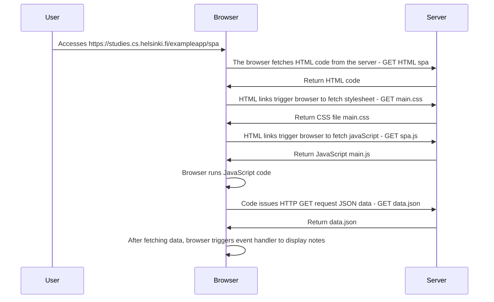

```mermaid
sequenceDiagram
    User->>Browser: Accesses https://studies.cs.helsinki.fi/exampleapp/spa
    Browser->>Server: The browser fetches HTML code from the server - GET HTML spa
    Server->>Browser: Return HTML code
    Browser->>Server: HTML links trigger browser to fetch stylesheet - GET main.css
    Server->>Browser: Return CSS file main.css
    Browser->>Server: HTML links trigger browser to fetch javaScript - GET spa.js
    Server->>Browser: Return JavaScript main.js
    Browser->>Browser: Browser runs JavaScript code 
    Browser->>Server: Code issues HTTP GET request JSON data - GET data.json
    Server->>Browser: Return data.json
    Browser->>Browser: After fetching data, browser triggers event handler to display notes
```
