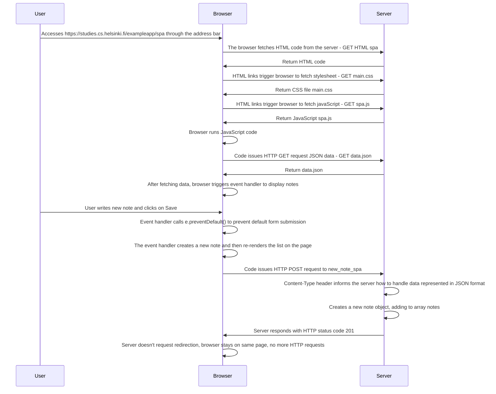

```mermaid
sequenceDiagram
    User->>Browser: Accesses https://studies.cs.helsinki.fi/exampleapp/spa through the address bar
    Browser->>Server: The browser fetches HTML code from the server - GET HTML spa
    Server->>Browser: Return HTML code
    Browser->>Server: HTML links trigger browser to fetch stylesheet - GET main.css
    Server->>Browser: Return CSS file main.css
    Browser->>Server: HTML links trigger browser to fetch javaScript - GET spa.js
    Server->>Browser: Return JavaScript spa.js
    Browser->>Browser: Browser runs JavaScript code 
    Browser->>Server: Code issues HTTP GET request JSON data - GET data.json
    Server->>Browser: Return data.json
    Browser->>Browser: After fetching data, browser triggers event handler to display notes
    User->>Browser: User writes new note and clicks on Save
    Browser->>Browser: Event handler calls e.preventDefault() to prevent default form submission
    Browser->>Browser: The event handler creates a new note and then re-renders the list on the page
    Browser->>Server: Code issues HTTP POST request to new_note_spa
    Server->>Server: Content-Type header informs the server how to handle data represented in JSON format
    Server->>Server: Creates a new note object, adding to array notes
    Server->>Browser: Server responds with HTTP status code 201
    Browser->>Browser: Server doesn't request redirection, browser stays on same page, no more HTTP requests
```
